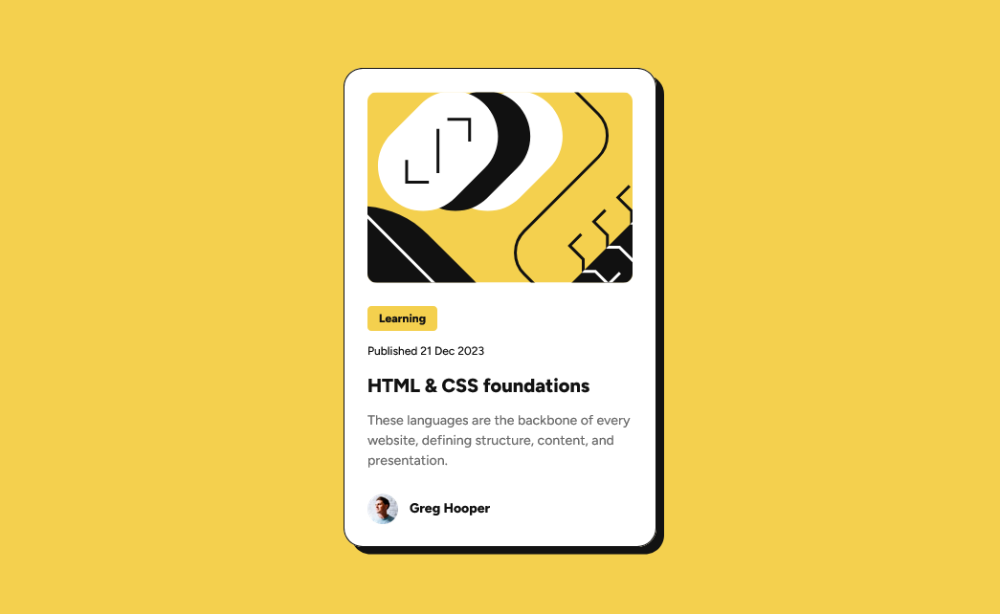

# Frontend Mentor - Blog preview card solution

This is a solution to the [Blog preview card challenge on Frontend Mentor](https://www.frontendmentor.io/challenges/blog-preview-card-ckPaj01IcS). Frontend Mentor challenges help you improve your coding skills by building realistic projects. 

## Table of contents


  - [The challenge](#the-challenge)
  - [Screenshot](#screenshot)
  - [Links](#links)
  - [My process](#my-process)
  - [Built with](#built-with)
  - [What I learned](#what-i-learned)
  - [Continued development](#continued-development)
  - [Author](#author)
  - [Acknowledgments](#acknowledgments)

**Note: Delete this note and update the table of contents based on what sections you keep.**

## Overview

### The challenge

Users should be able to:

- See hover and focus states for all interactive elements on the page

### Screenshot




### Links

- Solution URL: [Add solution URL here](https://your-solution-url.com)
- Live Site URL: [Add live site URL here](https://your-live-site-url.com)

## My process

### Built with

- Semantic HTML5 markup
- CSS custom properties
- Flexbox
- Mobile-first workflow

### What I learned

Se aprendio a usar la funcion clamp(); para cambiar el tamaño de fuente de los textos al adaptarse
a pantallas mas pequeñas sin usar media queries


```css
.text-title{
   
    font-size: clamp(1.25rem, 1.1vw, 1.5rem);;
   
}
```

### Continued development

Me gustaria seguir aprendiendo tecnicas que hagan el contenido responsive de manera mas facil y 
sin usar media queries


## Author

- Frontend Mentor - [@chris91-ctrl](https://www.frontendmentor.io/profile/chris91-ctrl)

## Acknowledgments

Agradecer al youtuber rocoDev que me ayudo con uno de sus videos a entender la funcion clamp()
